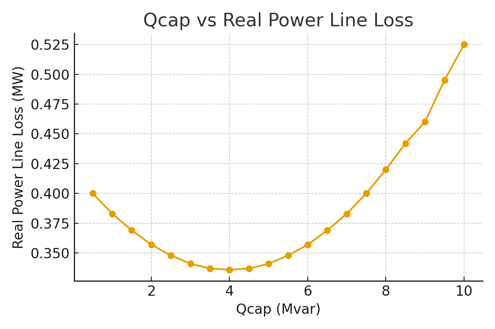
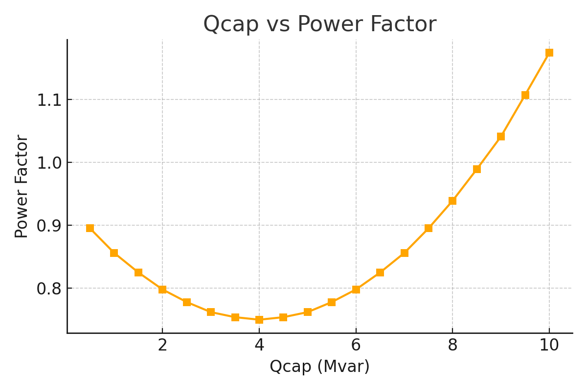

# PowerWorld Simulation Demo

This repository demonstrates the use of PowerWorld Simulator for power system modeling and analysis.
It includes building single-line diagrams, experimenting with reactive compensation, and reviewing
transmission line characteristics (e.g., SIL behavior). The repository originates from a taught assignment
and has been refactored into a reusable, research-style mini project.

## Repository Structure

powerworld-simulation-demo/
├── README.md
├── LICENSE
├── .gitignore
├── CONTRIBUTING.md
├── models/ # Put your .pwb / .pwd PowerWorld case + oneline files here
├── report/
│ ├── results_table.csv # Tabulated results from the capacitor sweep (Qcap vs losses, PF, etc.)
│ └── Powerworld_Assignment.pdf # (Optional) Export your original report here
└── figures/ # Screenshots/plots of models and results

## Key Topics Covered

1. PowerWorld basics
   - New case creation, edit mode, zoom & navigation
   - Solving power flow and observing breaker effects
2. Reactive compensation (capacitor banks)
   - Effect on generator power factor, reactive power (Qs), and line losses
   - Trade-off curve Qcap → Real Power Line Loss, with a loss minimum near Qcap ≈ 4.0 Mvar
3. Transmission lines
   - SIL concept and qualitative voltage behavior vs. loading
   - Example power transfer calculations (per-unit based Pmax)

## Example Result (from capacitor sweep)

See `report/results_table.csv` for the full table. A small excerpt:

| Qcap (Mvar) | Line Loss (MW) | Power Flow (Mvar) | Power Factor |
|-------------|-----------------|-------------------|--------------|
| 0.5         | 0.400           | 0.801             | 0.895        |
| 4.0         | 0.336           | 0.670             | 0.750        |
| 10.0        | 0.525           | 1.050             | 1.174        |

> Observation: Between 0.5–4.0 Mvar, feeder losses decrease; beyond ~4.5 Mvar, losses start to increase again, suggesting an optimum in that region.

## How to Reproduce

1. Open your `.pwb` / `.pwd` files in PowerWorld Simulator.
2. In Edit Mode, adjust bus/capacitor parameters (e.g., Qcap) and solve the case.
3. Record line losses, power factor, and reactive flow for each Qcap value.
4. Export results into CSV (see `report/results_table.csv`), and add key plots to `figures/`.

## Suggested Figures

- Single-line diagram screenshots (buses, lines, breakers)
- Capacitor sweep curves: Qcap vs Line Loss (MW) and Power Factor
- Transmission line illustrative example (SIL behavior)

## Notes

- The original assignment content is used here purely as an educational portfolio. Where applicable, cite course and lecturer.
- You may anonymize any sensitive metadata before publishing.

## Author

Jinyan Yang — MSc in Renewable Energy Systems
## Results and Analysis

The following plots illustrate the effect of capacitor compensation (Qcap) on both line losses and power factor.

### Qcap vs Real Power Line Loss

- As Qcap increases from 0.5 to ~4.0 Mvar, the real power line loss decreases steadily.  
- The minimum line loss occurs around Qcap = 4.0 Mvar.  
- Beyond 4.5 Mvar, line losses begin to rise again, indicating over-compensation.

### Qcap vs Power Factor

- At low Qcap (0.5 Mvar), the power factor is below 0.9.  
- As Qcap increases, the power factor improves and reaches above 1.0 for Qcap > 9.0 Mvar.  
- The improvement comes at the cost of higher line losses after the optimal region, suggesting a trade-off between power factor correction and efficiency.

---

## Key Insight
- The optimal Qcap ≈ 4.0 Mvar achieves the lowest line losses while keeping power factor at an acceptable level (~0.75–0.8).  
- Adding more capacitors beyond this point continues to improve power factor but increases line losses, which is undesirable.  
- This demonstrates the classic engineering balance between reactive power compensation and system efficiency in power system operation.
